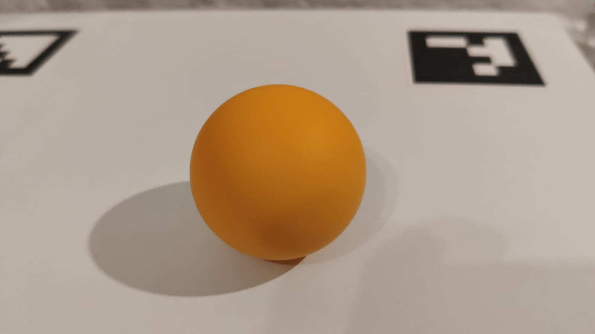
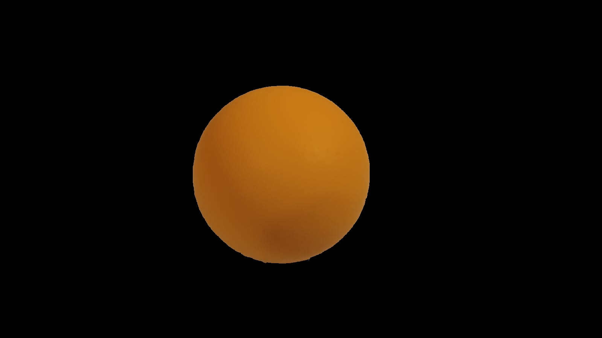
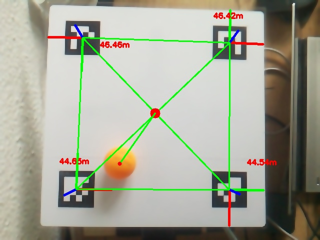
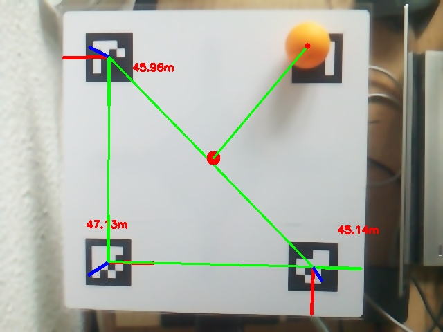
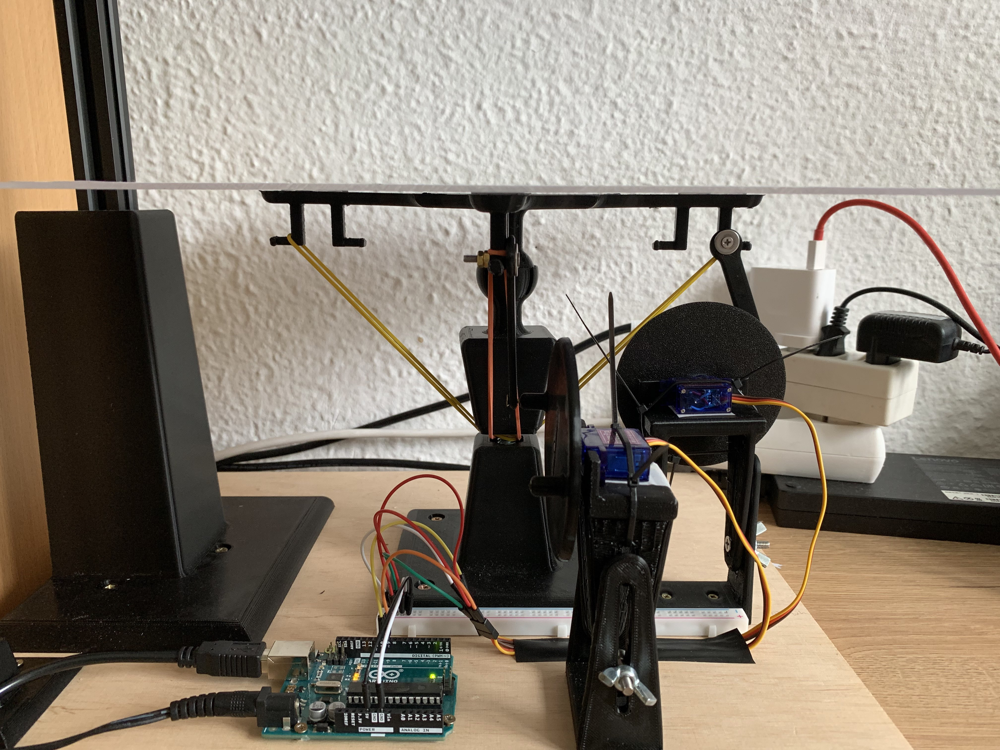
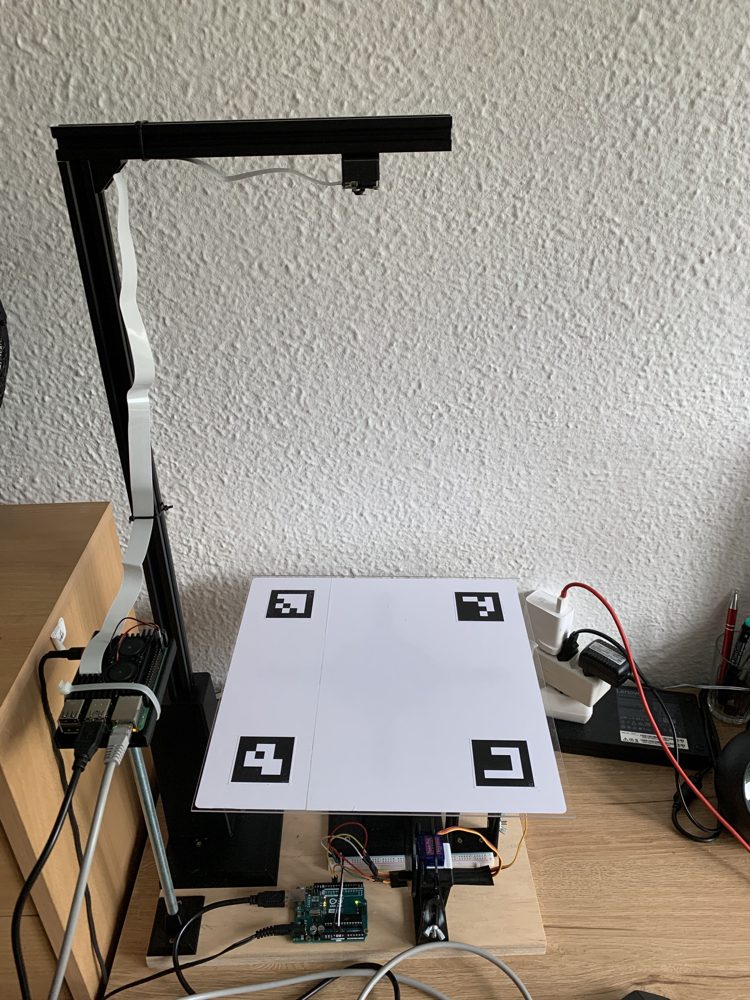

# PID Ball Balancing Platform

Dual-axis ball balancing platform. The ball's location on the platform, relative to the center, is detected using a vision system, while the platform's tilt is controlled by a PID controller in each axis. This controller determines the positions of the servo mechanisms to maintain the ball at the center of the platform. Image processing and the PID controllers are implemented on a Raspberry Pi 4 mini-computer with a Raspberry Pi camera, and the servo mechanisms are controlled indirectly through serial port communication with an Arduino Uno.

## Ball detection and localization

Localization of the ball is carried out by analyzing the image received from the camera using the OpenCV library. The center of the platform is determined by ArUco markers placed at the corners of the platform. The intersection of diagonals drawn from the extreme points determines the center. Then, the position of the ball in the image is determined and the vector of the ball's displacement relative to the center of the platform is established.

### Detection

The position of the ball on the image is determined in 3 steps:

- Apply mask that brings out the pixel values within the specified HSV range.

  

  

- Find contours on the image.
- Return the center biggest contour by area which is assumed to be the ball.

This works assuming that no objects with a color similar to the color of the ball are visible in the frame.

### Localization

The first step in the localization of the ball is determining the center of the platform. This is done using ArUco markers. After the center of the platform is determined, the distance of the ball in both axes in regard to the center of the platform is calculated.

  

The center of the platform is remembered in case any of the markers is covered by the ball.

  

## Balancing

The ball is balanced in each axis independently by two PIDs based on the distance from the center using servomechanisms that tilt the platform accordingly. The input to the regulator is the distance from the center of the platform and the output is the position of the servomechanism. Tuning the regulator was done manually. Final regulation constants are as follows:

- Kp = 0.38
- Ki = 0.022
- Kd = 0.1

## Platform Construction

Most elements were modeled using Fusion 360 and 3D printed. All models and drawings can be found in `/technical_drawings` directory.

All elements were glued to a wooden base. The camera stand was constructed using aluminium profiles. The platform is a plexi glass panel.

  

  

## Operation

A video showcasing the balancing platform operation has been uploaded to [YouTube](https://youtu.be/hny_5dCIR1Q).
