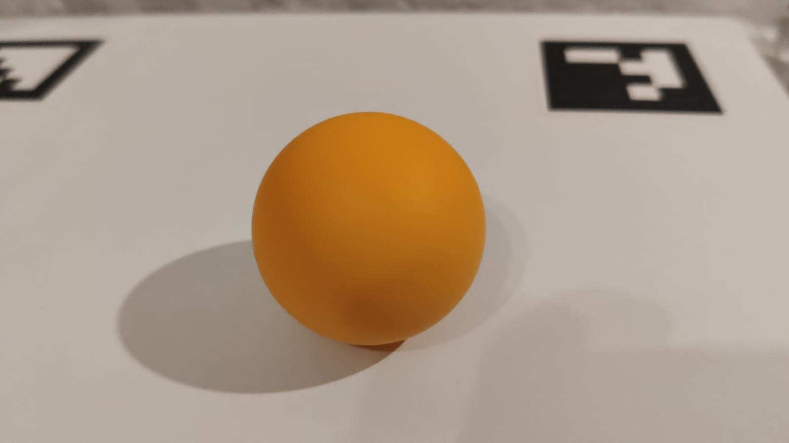

# PID Ball Balancing Platform

Dual-axis ball balancing platform. The ball's location on the platform, relative to the center, is detected using a vision system, while the platform's tilt is controlled by a PID controller in each axis. This controller determines the positions of the servo mechanisms to maintain the ball at the center of the platform. Image processing and the PID controllers are implemented on a Raspberry Pi 4 mini-computer, and the servo mechanisms are controlled indirectly through UART communication with an Arduino Uno.

## Ball detection and localization

Localization of the ball is carried out by analyzing the image received from the camera using the OpenCV library. The center of the platform is determined by ArUco markers placed at the corners of the platform. The intersection of diagonals drawn from the extreme points determines the center. Then, the position of the ball in the image is determined and the vector of the ball's displacement relative to the center of the platform is established. 

### Detection

The position of the ball on the image is determined in the following steps:

1. Converting the image to HSV color space
2. Apply a mask for the color of the ball. This highlights the pixels that represent the ball.

  

